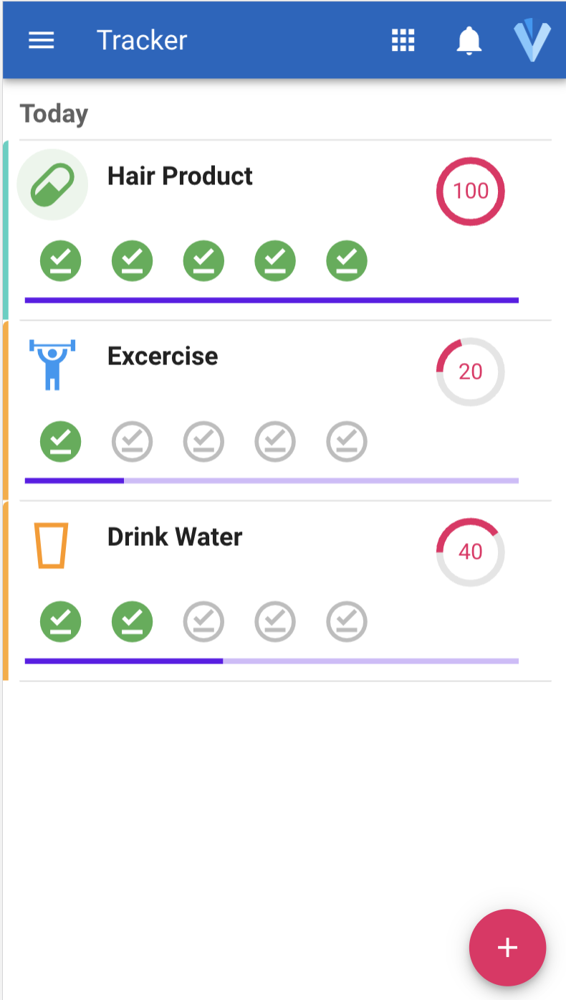

# app-tracker



The `app-tracker` is a simple mobile application I developed using Vue JS and firebase because my wife needed to track some kind of goal that had a start and end date and needed to be repeated several times a day or every other day.

For example taking antibiotics 3 times a day for 1 week.

This is a WIP project but the final product should offer the following functionality:

- Ability to add trackable goals from a template such as `antibiotics-template-3x-1w`. This would automatically create a trackable event for one week with 3 subtasks each day
- Users will be able to customize the dates, occurrences per day, notifications, title, etc...
- After an item is added the app would show all subtasks for that day, the overall progress of the whole task as a progress bar and the daily progress as a donut.
- Users complete a task by clicking on the task icon.

## Project setup
```
npm install
```

### Compiles and hot-reloads for development
```
npm run serve
```

### Compiles and minifies for production
```
npm run build
```

### Lints and fixes files
```
npm run lint
```

### Customize configuration
See [Configuration Reference](https://cli.vuejs.org/config/).
